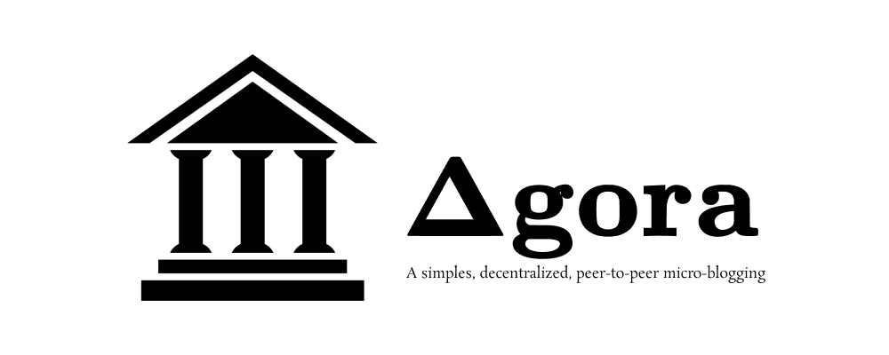
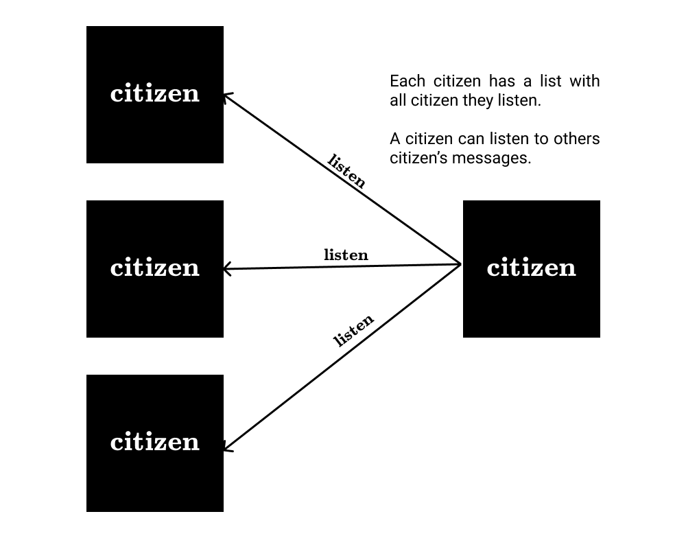
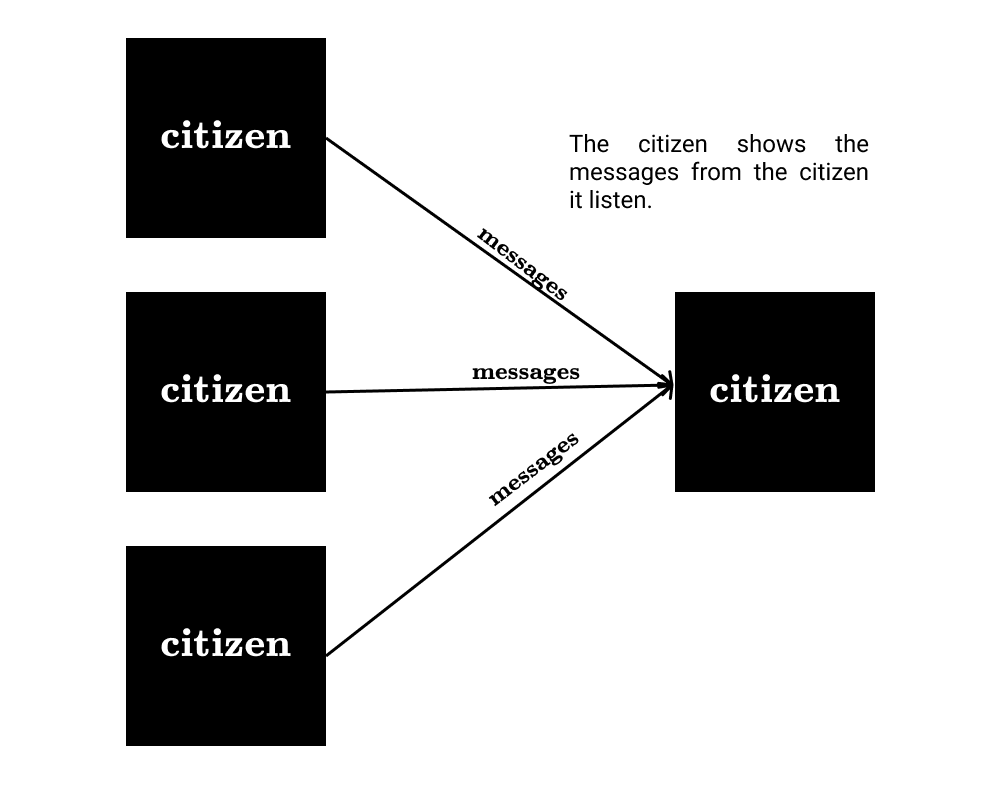
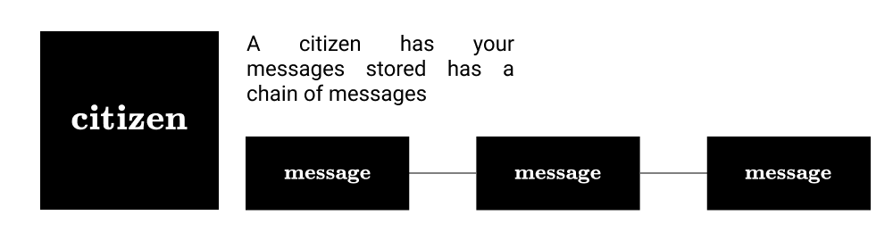

    

    
    

<h1>What is Ágora?</h1>

 Ágora is a simple, decentralized, peer-to-peer micro-blogging platform. The Ágora's objective is to provide a simple and
free way to share your thoughts and ideas through a decentralized network like common websites. 

<h1>Why Ágora?</h1>

Ágora's idea comes out  from my desire to study and practice about the decentralization. I believe this concept is 
essential to maintain the internet free for everyone. This project has the intent to create something like a 
decentralized `Twitter`, the social network what I most use currently.I know that this idea is so original, but  how I 
said, my first objective is to learn, if the project grown up, this will be just a collateral effect.

<h2> How to build Ágora?</h2>

Ágora is a composition of many <strong>citizens</strong>. A <strong>citizens</strong> is client and server what
implements the Ágora protocol. Each <strong>citizen</strong> has a name, an address, a list of messages and more. Each
node listen to other <strong>citizen</strong> to get its messages when requested.

<cite>I just have the initial idea about the Ágora protocol.</cite>

    

    

    

<strong>...</strong>

